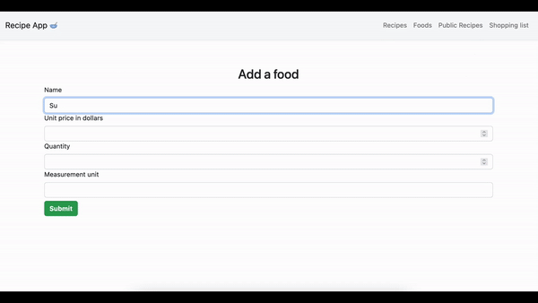

# Group-Project

> This is a ruby on rails application that allows users to create and manage recipes.

## Video

# Getting Started

To get a local copy up and running follow these simple steps.

- You can clone this repo by typing `git clone https://github.com/OkoyeCharles/rails-recipe-app.git` on your terminal.

- Type `cd recipes-app` to access the project on the terminal.
  
- Run `bundle install` to install all the required dependancies.

- Run `rails db:create` and `rails db:migrate` to create & migrate records to the database.

- Run `rails s` to start a development server.

# Testing

`bundle exec rspec` will run all the tests.

Also, you can run `bundle exec rspec spec/` to run specific tests.

You can also run `RAILS_ENV=test rspec spec/` to run the tests in test mode.

## Errors

If you encounter any errors, run the following commands.

- Run `rails db:migrate:reset` to drop, create and migrate a new database.

- Run `rubocop && rubocop -A` to check for and fix code errors.

# This project was built with

- Ruby on Rails

- Bootstrap CSS Framework

- Postgressql

# 👤 Authors

👤 **Daniel M. Matongo**

- GitHub: [@OkoyeCharles](https://github.com/OkoyeCharles)
- LinkedIn: [Okoye Charles](https://linkedin.com/in/charles-k-okoye)

👤 **Juliana Ifionu**

- GitHub: [@Bria222](https://github.com/Bria222)
- LinkedIn: [Brian (mr bree) nyachae](https://www.linkedin.com/in/brian-nyachae/)

# 🤝 Contributing

Contributions, issues, and feature requests are welcome!

Feel free to check the [issues page](https://github.com/okoyecharles/rails-recipes-app/issues).

# Show your support

Give a ⭐️ if you like this project!

# Acknowledgement

- Hat tip to anyone whose code was a source of inspiration.
- A big thanks to [@microverseinc](https://github.com/microverseinc).

# 📝 License

This project is [MIT](LICENSE) licensed.